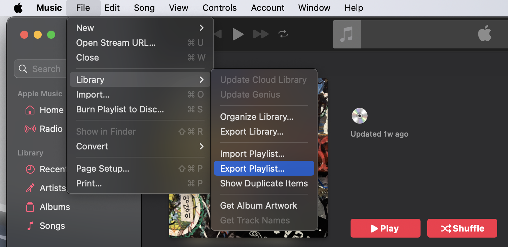

# Apple-to-Spotify-Playlist-Manager

This program helps transfer songs from an Apple Music playlist (exported as an XML file) to a Spotify playlist. While it automates much of the process, it does not guarantee that all songs will be transferred. You can use built-in tools to capture as many songs as possible and manually adjust where necessary.


## Prerequisites

### 1. Install Python
Ensure Python is installed on your system. Download it [here](https://www.python.org/downloads/).

### 2. Set Up a Virtual Environment

#### Steps:
1. **Create a virtual environment**:
   ```bash
   python -m venv venv
   ```

2. **Activate the virtual environment**:
   - On **Windows**:
     ```bash
     venv\Scripts\activate
     ```
   - On **macOS/Linux**:
     ```bash
     source venv/bin/activate
     ```

3. **Install dependencies**:
   ```bash
   pip install -r requirements.txt
   ```


## Steps to Use

### 1. Export Apple Music Playlist
Export an `.xml` file from the Apple Music desktop app and rename it to `playlist.xml`.



### 2. Get Spotify Credentials
Retrieve your `client_id` and `client_secret` from the [Spotify Developer Dashboard](https://developer.spotify.com/dashboard/).
If this is your first time using Spotify API, you'll have to create an app and then access the developer dashboard.

### 3. Create a `.env` File
In the project directory, create a `.env` file and add your Spotify credentials:

```
SPOTIFY_CLIENT_ID=your_client_id
SPOTIFY_CLIENT_SECRET=your_client_secret
```

### 4. Generate a Spotify Token
Run `token_manager.py`:

```bash
python token_manager.py
```

Follow the link provided in the terminal, log in to your Spotify account, and approve the app. This will create a `token.json` file in the directory. Press `CTRL+C` to quit after successful login.

### 5. Transfer Songs to a Spotify Playlist
Run `spotify_utils.py`:

```bash
python spotify_utils.py
```

This will:
- Generate a `cleaned_file.csv` with parsed songs from `playlist.xml`.
- Create a `found_uri_file.csv` containing songs matched with Spotify URIs.
- Create a `missing_uri_file.csv` listing songs that couldn't be matched.

The program will prompt you to select a Spotify playlist. Enter the corresponding number, and the matched songs will be added.

### 6. Handle Missing Songs
Review the `missing_uri_file.csv` file. Modify the `write_to_cleaned_csv` function in `xml_processor.py` to capture additional songs, or manually add missing entries.
**To test the modification, run the `xml_processor.py` individually to avoid duplicates in the new playlist.**


## Troubleshooting

1. **Playlist Not Found**:
   - Ensure the playlist is visible in your Spotify profile.
   - Check the playlist's public/private status and update the scopes in `token_manager.py` if necessary.

## Warning
Be cautious when running the program multiple times for the same playlist to avoid duplicates.
